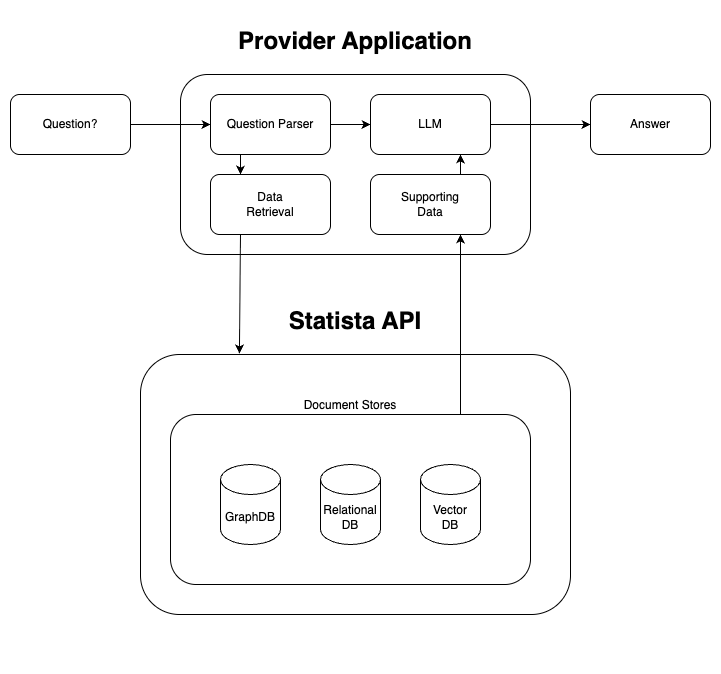

# Statista Case Study

Submission for the 
[Statista Case Study](docs/Case_Study_-_Software.pdf).

## Analysis

Statista is a large provider of data aiming to create an API for use with Retrieval-Augmented Generation (RAG) applications. Below is a workflow diagram of a simple RAG application. The provider application refers to any system that uses Statista data to enhance the performance of a large language model (LLM).



The Statista API will operate at the data retrieval layer of the RAG pipeline. It will return relevant documents that can be used to power an LLM, allowing it to generate more accurate and contextually relevant responses.

### Document Stores

A key factor in the usefulness of the Statista API is its ability to retrieve relevant results from a large corpus of over a million statistics across 80,000 topics. Depending on the nature of the data, different types of databases may be appropriate.

Although the sample data provided for this case study has a well-defined schema suitable for a relational database, this demo implements search functionality using a vector database. This approach was chosen due to the breadth and potentially unstructured nature of Statista’s data. A productionized version could support querying from multiple databases types if needed.

## Code

A small demo application has been developed to illustrate how an API can query a vector store to retrieve documents for use in RAG applications.

Key features:

* Written in Python 3.13
* Uses Faker to generate mock data
* Uses FastAPI for the RESTful API
* Uses ChromaDB as the vector store

### Instructions

1. Install Dependencies

    ```bash
    pip install -r requirements.txt
    ```

1. Create Mock Data (Optional)

    ```bash
    python mock_data.py
    ```

    This step creates and caches mock data in `mock_data.json`. If you want to regenerate the mock data, delete this file. Note: if the file does not exist, it will be created automatically when populating the vector store in the next step.

1. Populate the Chroma Vector Store

    ```bash
    python vector_store.py
    ```

    This script loads the mock data into a Chroma database and persists it in the `mock_data_chroma.db` folder. Future runs will use this persisted store. To reset the database, delete the folder and re-run the script.

1. Run the API Endpoint

    ```bash
    fastapi dev main.py
    ```

    Visit the API documentation in Swagger UI:

    http://127.0.0.1:8000/docs

    You can explore available endpoints and view the expected payload schema. Click the "Try it out" button to interact with the API directly and see the responses.
